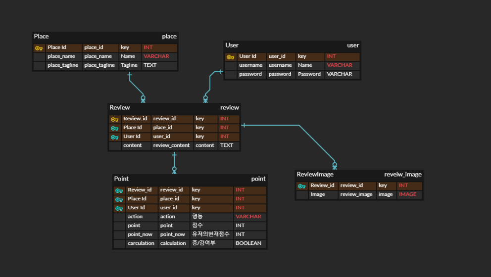

## 사전과제 

### AccountApp

#### Usermodel

- 게시글에 댓글을 남기려면 User가 필수적으로 있어야하기 때문에 먼저 Usermodel을 생성한다. 
- Signup Serializer를 만들었고, 우선적 과제를 수행하기 위해, 회원가입 테스트 결과 성공
- Login은 jwt토큰 발급으로 대체 
- 로그인 진행시,  jwt토큰 발급으로 인증을 진행하며, Frontend Stroe에 로그인 시 사용한 userID를 담는다고 가정하고 리뷰 기능 개발 진행 

### PlaceApp

#### PlaceModel

- 요구되지 않았지만, 리뷰 작성 시 Place가 필수불가결하므로, PlaceModel을 생성해 가상 데이터를 생성해야할 필요가 있음
- 기본적으로, 이름, 한줄소개만 필드에 추가할 예정 

#### ReviewModel

- 리뷰에는 Create,Update,Delete 기능이 필요하며, 모델 내 필드에는 PK, 사진, UserId, 장소 Id가 필요함 
  - 따라서, User는 리뷰를 1개만 달 수 있지만 여러 게시물에 리뷰를 달 수 있기 때문에, User와 리뷰간 1:N관계를 만들고 이미 리뷰가 존재하면 수정하기로 자동으로 redirect되게 하자., 장소에 여러 리뷰가 있을 수 있기 때문에 1:N 관계를 만들어야할 것으로 생각됨 
  
- 앱 상에서는 별점 기능이 있고, context가 없더라도 별점을 부여하면 context가 자동으로 생성되는데, 해당 경우에는 별점 필드가 제시되지 않았기 때문에, 어떻게 할지 정해야할 것 같다. 
  1. 리뷰관련 UserM:N 필드를 각 조건에 따라 3개 만들기. 
  2. 분기처리를 통해 포인트만 알 수 있게 하기.. 

- 추가 점수 부여조건
  - 1자 이상 텍스트 1점 
  - 1자 이상 사진 1점 
  - 첫리뷰라면 보너스 1점 
  
- 포인트 조건

  - Review와 1:N 관계를 가지는 포인트 테이블을 만든다. 

  - 조건에 따라 포인트를 부여하고 포인트테이블에 기록한다. (유저, 장소, 행동(작성,수정,삭제),점수)

  - #### 작성

    - 조건 1 : 게시글을 작성하면 1점의 포인트를 준다. 
    - 조건 2 : 사진이 있으면 1점의 포인트를 추가로 준다. 
    - 조건 3 : 첫 리뷰이면 보너스 점수 1점을 준다. 

    ```python
    if request.method == 'POST' : 
        if content : 
            point += 1 
        if image : 
            point += 1 
        if !(place.review.exist()) :
            point += 1 
    ```

    - 넘겨줄 때는, 액션과 점수를 넘긴다.

  - #### 수정

    - 조건1 : 글만 작성한 리뷰에 사진을 추가하면 1점 
      - 사진만 작성한 리뷰에서 글을 추가하면 1점 

    - 조건 2:  글과 사진이 있는 리뷰에서 사진을 모두 삭제하면 1점을 회수 
      - 글과 사진이 있는 리뷰에서 글을 삭제하면 1점 회수


    ```python
    if request.method == 'PUT' :
        review = get_object_or_404(Review, pk=review_pk)
        #둘다 있었을 때 
        if review.content & review.image : 
            if data.content 가 없으면서 image는 있으면 :
                point -= 1 
            elif data.content가 있으면서 image가 없으면 :
                point -= 1 
            elif data.content가 없으면서 image도 없으면  :
                point -= 2
            #둘다 여전히 있으면
            else :
            	point = point 
       #content만 있었을 때
    	elif review.content & !(review.image) :
            ##
        #이미지만 있었을 때 
        elif !(review.content) & review.image :
            ##
            
        else : 
            #잘못된 요청 
        
    ```

  - #### 삭제

    - 리뷰를 삭제하면 점수 모두 회수                                                                                                                                       


##### REMARK를 신경쓰며 개발하자 




### DRF 서버 구상하기

- Plcae List 
- Place Detail
- Point log List 
- Review List (Review_image를 역참조 )
- Review Detail (User 참조 Place 참조  Image 역참조 )


# 실행 방법

## 환경 세팅

### python 가상환경 설치

```
python -m venv venv
```

### requirements 설치

```
pip install -r requirements.txt
```

### 가상환경 실행

```
source venv/Scripts/activate
```

### mysql 연결 

- Mysql Command Line Client 실행

- Password 입력
  - 환경 생성자의 경우 User = root

```mys
mysql> create database homework character set utf8mb4 collate utf8mb4_general_ci;
Query OK, 1 row affected (0.01 sec)

mysql> use homework
mysql> show tables;
```

- 환경 세팅의 경우 root폴더의 [my_settings.py](my_settings.py)에서 수정 가능


### 마이그레이션

```
python manage.py makemigrations
python manage.py migrate
```


## 계정 생성

```
python manage.py createsuperuser
사용자 이름: admin
이메일 주소: 
Password: test12!@
Password (again): test12!@
Superuser created successfully.
```

### 장소 데이터(가상 데이터) 불러오기

```
python manage.py loaddata dumpdata/place.json
```

## 테스트(testcode)

### 리뷰 작성 테스트

root/place/tests/test_post.py

```
python manage.py test place.tests.test_post
```

- 실행 결과 

```python
{"type":"REVIEW",
 "action":"ADD",
 "pk":1,
 "content":"한강 너무 좋았어요",
 "images"[{"pk":1}],
 "user":2,
 "place":1}
```

### 포인트 로그 및 포인트 조회

```
python manage.py test accounts
```

- 실행 결과

```python
test의 포인트 로그[{"id":1,
              "action":"작성",
              "calculation":true,
              "point":3,
              "user":2,
              "place":1}]

test의 현재 point{"pk":2,
               "point":3}
```


### 리뷰 수정 테스트(Image 삭제)

```
python manage.py test place.tests.test_edit
```

- 실행결과

```python
{"type":"REVIEW",
 "action":"MOD",
 "pk":1,
 "content":"한강 너무 좋았어요2",
 "images":[],
 "user":2,
 "place":1}
```


### 포인트 로그 및 포인트 조회

```
python manage.py test accounts
```

- 실행 결과

```python
test의 포인트 로그[{"id":1,
              "action":"작성",
              "calculation":true,
              "point":3,
              "user":2,"place":1}
             ,
             {"id":2,
              "action":"수정",
              "calculation":false,
              "point":-1,
              "user":2
              ,"place":1}]
test의 현재 point{"pk":2,"point":2}
```


### 리뷰 삭제 테스트

```
python manage.py test place.tests.test_delete
```

- 실행결과

```python
{"type":"REVIEW",
 "action":"DELETE",
 "pk":null,
 "content":"한강 너무 좋았어요2",
 "images":[],
 "user":2,
 "place":1}
```


### 포인트 로그 및 포인트 조회

```
python manage.py test accounts
```

- 실행 결과

```python
test의 포인트 로그[{"id":1,
              "action":"작성",
              "calculation":true,
              "point":3,
              "user":2,"place":1}
             ,
             {"id":2,
              "action":"수정",
              "calculation":false,
              "point":-1,
              "user":2
              ,"place":1},
             {"id":3,
              "action":"삭제",
              "calculation":false,
              "point":-2,
              "user":2,
              "place":1}]
test의 현재 point{"pk":2,"point":0}
```

