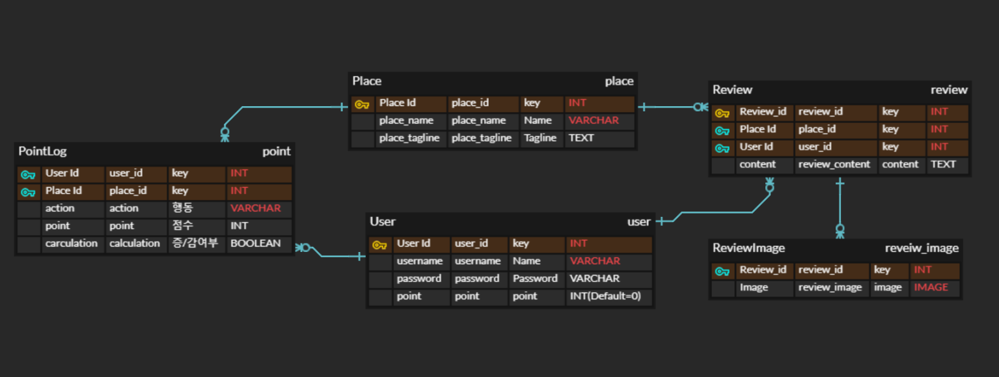

[TOC]

# 사전과제 

## ERD 



## 모델

### AccountApp

#### Usermodel

- 게시글에 댓글을 남기려면 User가 필수적으로 있어야하기 때문에 먼저 Usermodel을 생성한다. 
- Signup Serializer를 만들었고, 우선적 과제를 수행하기 위해, 회원가입 테스트 결과 성공
- Login은 jwt토큰 발급으로 대체 
- 로그인 진행시,  jwt토큰 발급으로 인증을 진행하며, Frontend Stroe에 로그인 시 사용한 userID를 담는다고 가정하고 리뷰 기능 개발 진행 

### PlaceApp

#### PlaceModel

- 요구되지 않았지만, 리뷰 작성 시 Place가 필수불가결하므로, PlaceModel을 생성해 가상 데이터를 생성해야할 필요가 있음
- 기본적으로, 이름, 한줄소개만 필드에 추가할 예정 

#### ReviewModel

- 리뷰에는 Create,Update,Delete 기능이 필요하며, 모델 내 필드에는 PK, 사진, UserId, 장소 Id가 필요함 
  - 따라서, User는 리뷰를 1개만 달 수 있지만 여러 게시물에 리뷰를 달 수 있기 때문에, User와 리뷰간 1:N관계를 만들고 이미 리뷰가 존재하면 수정하기로 자동으로 redirect되게 하자., 장소에 여러 리뷰가 있을 수 있기 때문에 1:N 관계를 만들어야할 것으로 생각됨 
  
- 앱 상에서는 별점 기능이 있고, context가 없더라도 별점을 부여하면 context가 자동으로 생성되는데, 해당 경우에는 별점 필드가 제시되지 않았기 때문에, 어떻게 할지 정해야할 것 같다. 
  1. 리뷰관련 UserM:N 필드를 각 조건에 따라 3개 만들기. 
  2. 분기처리를 통해 포인트만 알 수 있게 하기..

- 추가 점수 부여조건
  - 1자 이상 텍스트 1점 
  - 1자 이상 사진 1점 
  - 첫리뷰라면 보너스 1점 
  
- 포인트 조건

  - Review와 1:N 관계를 가지는 포인트 테이블을 만든다. 

  - 조건에 따라 포인트를 부여하고 포인트테이블에 기록한다. (유저, 장소, 행동(작성,수정,삭제),점수)

  - #### 작성

    - 조건 1 : 게시글을 작성하면 1점의 포인트를 준다. 
    - 조건 2 : 사진이 있으면 1점의 포인트를 추가로 준다. 
    - 조건 3 : 첫 리뷰이면 보너스 점수 1점을 준다. 

    ```python
    if not (PlaceSerializer(place).data['reviews']) :
                point += 1 
            #유효성검사 통과하면 
            if serializer.is_valid():
                #저장 
                serializer.save(user=self.request.user,place=place)
                
                #사진이 있을 때             
                if serializer.data['images'] :
                    point +=1 
                #내용이 있을 때 
                if serializer.data['content']  :
                    point += 1 
    
                pointlog = PointLog.objects.create(user=self.request.user,place=place,
                            action='작성',calculation=True,point=point)
                pointlog.save()
                user = get_object_or_404(User,username=request.user)
                user.point += point 
                user.save()
                response_dict = {'type':'REVIEW','action' : "ADD"}
                response_dict.update(serializer.data)
                return Response(data=response_dict, status=status.HTTP_201_CREATED)
    ```
  
    - 넘겨줄 때는, 액션과 점수를 넘긴다.
  
  - #### 수정
  
    - 조건1 : 글만 작성한 리뷰에 사진을 추가하면 1점 
      - 사진만 작성한 리뷰에서 글을 추가하면 1점 
  
    - 조건 2:  글과 사진이 있는 리뷰에서 사진을 모두 삭제하면 1점을 회수 
      - 글과 사진이 있는 리뷰에서 글을 삭제하면 1점 회수


        def put(self, request,place_pk,review_pk):
            #작성된 리뷰 content나 사진이 있을 때,
            review = get_object_or_404(Review,pk=review_pk) 
            point = 0
            serializer = ReviewSerializer(instance=review,data=request.data, context={"request": request,'review_pk':review_pk})
            
            place = get_object_or_404(Place, pk=place_pk)
    
            is_content = bool(review.content)
            is_image = bool(review.reviewimage_set.all())
            #유효성검사 통과하면 
            if serializer.is_valid():
                #저장 
                serializer.save(user=self.request.user,place=place)
                response_dict = {'type':'REVIEW','action' : "MOD"}
                #기존 리뷰에 사진이 있었지만 방금 수정한 사항에는 없을 때         
                if is_image and not serializer.data['images'] :
                    point -= 1 
    
                #기존 리뷰에 사진이 없었지만 방금 수정한 사항에는 있을 때 
                elif not is_image and serializer.data['images']:
                    point += 1 
    
    
                #기존 리뷰에 내용이 있었지만 방금 수정한 사항에는 없을 때
                if is_content and not serializer.data['content'] : 
                    point -= 1 
    
                elif not is_content and serializer.data['content'] :
                    point += 1 
    
                if point == 0 :
                    response_dict.update(serializer.data)
                    return Response(data=response_dict)
                
                #증감 여부 초기값 True 
                calculation = True 
    
                #point가 증가하면 True 
                if point >0 :
                    calculation = True 
                #감소하면 False
                elif point<0 :
                    calculation = False
                pointlog = PointLog.objects.create(user=self.request.user,place=place,
                            action='수정',calculation=calculation,point=point)
                pointlog.save()
                user = get_object_or_404(User,username=request.user)
     
                user.point += point 
                user.save()
                
                response_dict.update(serializer.data)
                
                return Response(data=response_dict)

  - #### 삭제

    - 리뷰를 삭제하면 해당 리뷰로 받은 점수 모두 회수
    
    ```python
    def delete(self,request,place_pk,review_pk) :
            review = get_object_or_404(Review,pk=review_pk) 
            serializer = ReviewSerializer(instance=review)
            point = 0
            is_content = bool(review.content)
            is_image = bool(review.reviewimage_set.all())
            if is_content :
                point -= 1 
            if is_image :
                point -= 1 
            
            place = get_object_or_404(Place,pk=place_pk)
    
            first_review = place.reviews.all()[0]
            if first_review ==review :
                point -= 1 
            pointlog = PointLog.objects.create(user=self.request.user,place=place,
                action='삭제',calculation=False,point=point)
            pointlog.save()
            user = get_object_or_404(User,username=request.user)
    
            user.point += point 
            user.save()
            review.delete()
            response_dict = {'type':'REVIEW','action' : "DELETE"}
            response_dict.update(serializer.data)
            return Response(response_dict,status=status.HTTP_204_NO_CONTENT
    ```
    
    

### DRF 서버 URL 

#### Base

| URL      | 설명         | 데이터            | HTTP |
| -------- | ------------ | ----------------- | ---- |
| admin/   | 관리자페이지 | username,password | POST |
| swagger/ | swagger      |                   | GET  |

#### accounts

| URL                            | 설명                    | 요구 데이터       | HTTP |
| ------------------------------ | ----------------------- | ----------------- | ---- |
| api/v1/accounts/signup/        | 회원가입                | username,password | POST |
| api/v1/accounts/gettoken/      | 로그인 및 jwt 토큰 발급 | username,password | POST |
| api/v1/pointlog/\<int:user_pk> | user의 포인트 기록 확인 | user_pk           | GET  |
| api/v1/point/\<int:user_pk>    | user의 현재 포인트      | user_pk           | GET  |

#### place

| URL                                                   | 설명                         | 요구 데이터                                   | HTTP   |
| ----------------------------------------------------- | ---------------------------- | --------------------------------------------- | ------ |
| api/v1/place/                                         | 장소조회                     |                                               | GET    |
| api/v1/place/\<int:place_pk>/                         | 장소의 상세정보 및 리뷰 확인 | place_pk                                      | GET    |
| api/v1/place/\<int:place_pk>/reviews/                 | 장소의 리뷰 전체 조회        | place_pk                                      | GET    |
| api/v1/place/\<int:place_pk>/reviews/                 | 리뷰 작성                    | place_pk, content(null=True),image(null=True) | POST   |
| api/v1/place/\<int:place_pk>/review/\<int:review_pk>/ | 리뷰 수정                    | place_pk, content(null=True),image(null=True) | PUT    |
| api/v1/place/\<int:place_pk>/review/\<int:review_pk>/ | 리뷰 삭제                    |                                               | DELETE |

# 실행 방법

## 환경 세팅

### python 가상환경 설치

```
python -m venv venv
```

### requirements 설치

```
pip install -r requirements.txt
```

### 가상환경 실행

```
source venv/Scripts/activate
```

### mysql 연결 

- Mysql Command Line Client 실행

- Password 입력
  - 환경 생성자의 경우 User = root

```mys
mysql> create database homework character set utf8mb4 collate utf8mb4_general_ci;
Query OK, 1 row affected (0.01 sec)

mysql> use homework
mysql> show tables;
```

- 환경 세팅의 경우 root폴더의 [my_settings.py](my_settings.py)에서 수정 가능


### 마이그레이션

```
python manage.py makemigrations
python manage.py migrate
```


## 계정 생성

```
python manage.py createsuperuser
사용자 이름: admin
이메일 주소: 
Password: test12!@
Password (again): test12!@
Superuser created successfully.
```

admin page url에 접속하여, createsuperuser로 가입한 username과 password를 입력하면, 모든 모델에 대한 CRUD가 가능합니다.

 http://127.0.0.1:8000/admin/ 

### 장소 데이터(가상 데이터) 불러오기

```
python manage.py loaddata dumpdata/place.json
```

## 기본 테스트(testcode)

```
python manage.py runserver
```

**각 앱에서 테스트코드를 수정하여 다양한 테스트를 할 수 있습니다.** 

- accounts, place

### 테스트 흐름

- User의 리뷰 작성 (content와 Image 포함)
  - 사진,리뷰를 포함한 첫 게시물 작성으로 Point += 3 
  - 현재 point 3 
- 리뷰 수정과정에서 content 변경 Image 제거 
  - Point -1 
  - 현재 point 2

- 리뷰 삭제
  - 첫 리뷰 작성 point 1점과 content로 인한 point 1점이 제거
  - 현재 Point0

### 1. 리뷰 작성 테스트

root/place/tests/test_post.py

```
python manage.py test place.tests.test_post
```

- 실행 결과 

```python
{"type":"REVIEW",
 "action":"ADD",
 "pk":1,
 "content":"한강 너무 좋았어요",
 "images"[{"pk":1}],
 "user":2,
 "place":1}
```

#### 포인트 로그 및 포인트 조회

```
python manage.py test accounts.tests.test_user1
```

- 실행 결과

```python
test의 포인트 로그[{"id":1,
              "action":"작성",
              "calculation":true,
              "point":3,
              "user":2,
              "place":1}]

test의 현재 point{"pk":2,
               "point":3}
```


### 2. 리뷰 수정 테스트(Image 삭제)

```
python manage.py test place.tests.test_edit
```

- 실행결과

```python
{"type":"REVIEW",
 "action":"MOD",
 "pk":1,
 "content":"한강 너무 좋았어요2",
 "images":[],
 "user":2,
 "place":1}
```


### 포인트 로그 및 포인트 조회

```
python manage.py test accounts.tests.test_user1
```

- 실행 결과

```python
test의 포인트 로그[{"id":1,
              "action":"작성",
              "calculation":true,
              "point":3,
              "user":2,"place":1}
             ,
             {"id":2,
              "action":"수정",
              "calculation":false,
              "point":-1,
              "user":2
              ,"place":1}]
test의 현재 point{"pk":2,"point":2}
```


### 3. 리뷰 삭제 테스트

```
python manage.py test place.tests.test_delete
```

- 실행결과

```python
{"type":"REVIEW",
 "action":"DELETE",
 "pk":null,
 "content":"한강 너무 좋았어요2",
 "images":[],
 "user":2,
 "place":1}
```


### 포인트 로그 및 포인트 조회

```
python manage.py test accounts.tests.test_user1
```

- 실행 결과

```python
test의 포인트 로그[{"id":1,
              "action":"작성",
              "calculation":true,
              "point":3,
              "user":2,"place":1}
             ,
             {"id":2,
              "action":"수정",
              "calculation":false,
              "point":-1,
              "user":2
              ,"place":1},
             {"id":3,
              "action":"삭제",
              "calculation":false,
              "point":-2,
              "user":2,
              "place":1}]
test의 현재 point{"pk":2,"point":0}
```


## 테스트 2 

### 테스트 흐름

- test1이 한강에 리뷰를 남김

- 기존 리뷰가 있는 게시글에, user2가 게시글 작성 
  - content만 포함
  - point 1추가
  - 현재 point 1
- 리뷰 수정 과정에서 Image 추가 
  - point += 1 
  - 현재 point 2 
- 리뷰 삭제 
  - point -=2 
  - 현재 point 0

### 1. 리뷰 작성 테스트(test1)

```
python manage.py test place.tests.test_post1
```

- 실행 결과 

```python
{"type":"REVIEW",
 "action":"ADD",
 "pk":2,
 "content":"한강 너무 좋았어요",
 "images":[{"pk":2}],
 "user":2,
 "place":1}
```

#### 포인트 로그 및 포인트 조회

```
python manage.py test accounts.tests.test_user1
```

- 실행 결과

```python
test의 포인트 로그
[{"id":1,
  "action":"작성",
  "calculation":true,
  "point":3,
  "user":1,
  "place":1},
 {"id":2,
  "action":"수정",
  "calculation":false,
  "point":-1,
  "user":1,
  "place":1},
 {"id":3,
  "action":"삭제",
  "calculation":false,
  "point":-2,
  "user":1,
  "place":1},
 {"id":4,
  "action":"작성",
  "calculation":true,
  "point":3,
  "user":1,
  "place":1}]
test의 현재 point{"pk":1,"point":3}
```

### 2. . 리뷰 작성 테스트(test2)

```
python manage.py test place.tests.test_post2
```

- 실행 결과 

```python
{"type":"REVIEW",
 "action":"ADD",
 "pk":3,
 "content":"저는 테스트2번입니다. 한강 너무 좋았어요",
 "images":[],
 "user":2,
 "place":1}
```

#### 포인트 로그 및 포인트 조회

```
python manage.py test accounts.tests.test_user1
```

- 실행 결과

```python
test2의 포인트 로그[{"id":6,
              "action":"작성",
              "calculation":true,
              "point":1,
              "user":2,
              "place":1}]

test2의 현재 point{"pk":2,
               "point":1}
```


### 3. 리뷰 수정 테스트(Image 추가)

```
python manage.py test place.tests.test_edit2
```

- 실행결과

```python
{"type":"REVIEW",
 "action":"MOD",
 "pk":3,
 "content":"저는 테스트2번입니다. 한강 너무 좋았어요를 수정했어요",
 "images":[{"pk":3}],
 "user":2,
 "place":1}
```


### 포인트 로그 및 포인트 조회

```
python manage.py test accounts.tests.test_user2
```

- 실행 결과

```python
test2의 포인트 로그[{"id":6,
              "action":"작성",
              "calculation":true,
              "point":1,
              "user":2,
              "place":1},
             {"id":7,
              "action":"수정",
              "calculation":true,
              "point":1,
              "user":2,
              "place":1}]

test2의 현재 point{"pk":2,
               "point":2}
```


### 4. 리뷰 삭제 테스트

```
python manage.py test place.tests.test_delete2
```

- 실행결과

```python
{"type":"REVIEW",
 "action":"DELETE",
 "pk":null,
 "content":"저는 테스트2번입니다. 한강 너무 좋았어요를 수정했어요",
 "images":[{"pk":3}],
 "user":2,
 "place":1}
```


### 포인트 로그 및 포인트 조회

```
python manage.py test accounts.tests.test_user2
```

- 실행 결과

```python
test2의 포인트 로그[{"id":6,
              "action":"작성",
              "calculation":true,
              "point":1,
              "user":2,
              "place":1},
             {"id":7,
              "action":"수정",
              "calculation":true,
              "point":1,
              "user":2,
              "place":1},
             {"id":8,
              "action":"삭제",
              "calculation":false,
              "point":-2,
              "user":2,
              "place":1}]

test2의 현재 point{"pk":2,
               "point":0}
```


## 테스트 3(POSTMAN)

### 회원가입(POST 요청)


### 로그인 및 JWT 토큰 발급(POST 요청)


#### 발급받은 토큰을 header에 저장

- JWT {token}


### pk가 5인 경복궁에 리뷰 작성해보기(POST)

- content 입력
- 사진 3개 입력 


### 포인트 및 포인트 로그 확인해보기(GET)


### 리뷰 수정 후 포인트 로그 확인하기 

- 이미지를 공백으로 수정 후 다시 이미지 넣어보고 로그 확인하기
  - 이미지를 공백으로 수정했으니 2포인트, 다시 넣으면 다시 3포인트가 될 것으로 예상


### 리뷰 여러곳에 쓰고 포인트 확인하기

- 현재 test3가 리뷰를 쓰지 않은 곳은 1,2,3,4번 장소 
- 현재 test3의 point는 3점 


- 1,2,3,4 번에 content와 사진을 포함해 리뷰를 쓴다면 첫 리뷰인 2,3,4 장소에서는 3점씩 1번 장소(한강)에서는 2점을 얻어 총 11점이 추가되어 최종 포인트가 14점일 것으로 예상됨 

#### 결과 확인

- 리뷰 작성 여부


#### 포인트 및 포인트 로그 확인해보기 


- 예상대로 point 14점이 잘 나온 것을 알 수 있음 


## 회고

#### 한 리뷰에 여러 이미지 넣기 

-  1:N관계의 필드를 만들고, 한번의 post/put 요청으로 N필드에 데이터를 저장해보지 않아서 어려움을 겪었습니다.
- 또한, 이미지 필드이기 때문에, 데이터 핸들링에 어려움을 겪었으나, 레퍼런스를 참고해서 해결했습니다.
- 평소 DRF 서버를 설계할 때, function based view로 설계를 진행했으나, 레퍼런스를 참고해서 class based view로 진행했습니다. 
- 레퍼런스에는 생성에 대한 예제만 제공되어, 해당 게시글을 기반으로 update 기능을 만드는데, 오랜시간이 소요되었으나 결과적으로 기능을 구현했습니다.

- 참고 링크 : https://stackoverflow.com/questions/39645410/how-to-upload-multiple-files-in-django-rest-framework

#### frontend에서 데이터를 어떻게 줄까?

- DRF 서버를 구축한 만큼 client에서 정보를 받고 해당 요청에 따라 API 응답을 보내줘야할 때, 어떤 부분을 DRF에서 맡고, 어떤 부분을 client에서 맡을지 생각해보게 되었던 것 같습니다.
- JWT인증 기반으로 request user를 판단하려고 하여, jwt 인증을 사용했습니다. user 로그인 시 client에서 localstorage나 state에 jwt를 저장 후 header에 담아서 요청을 보낸다고 생각하고 testcode와 postman을 이용하였습니다.
- 하지만 update 같은 경우에는, 예측이 잘 되지 않았습니다. 먼저 저장된 instance를 리뷰 조회화면에서 제공해준다고 가정했을 때, 실제 client에서 원래 이미지와 추가된 이미지 정보를 보낼 때 이미 백엔드 서버에 저장된 이미지인지, 아닌지 구분하는 로직을 설계하지 못했습니다.
  - 임시적으로, image의 이름으로 분기처리를 시도하고, 원래 서버에 저장된 instance image의 수와 새로 들어온 image data의 수를 계산하여, 임시적으로 분기처리를 하여 중복을 최대한 방지하려 했습니다.

#### request 및 response 응답 

- 작성된 리뷰가 1자 이상인지, 리뷰가 있는지, 사진이 있는지, 없는지 등에 따라 point 적립 분기처리를 진행하며 response 응답에 다양한 형태를 배울 수 있었습니다.

- 또한, 문제에서 요구한 API응답을 제공하기 위해 serializer.data를 update하는데 어려움을 겪었습니다. stackoverflow에서 새로운 dictionary에 해당 데이터를 update 하는 방식을 알게되었고, 해결할 수 있었습니다.

- 참고 링크 : https://stackoverflow.com/questions/37111118/update-append-serializer-data-in-django-rest-framework


